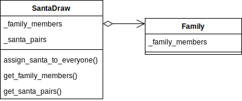
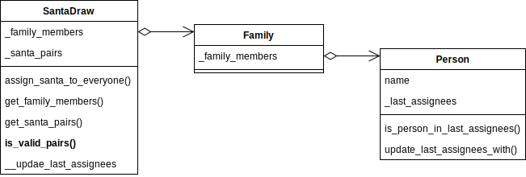

# Secret Santa Draw
Secret Santa Draw aims to match a "Secret Santa" to a member of the extended family, not themselves, for everyone.

The concept of Secret Santa Draw is from this.
*Imagine* that every year your extended family does a "Secret Santa" gift exchange. 
For this gift exchange, each person draws another person **at random** and then gets a gift for them. 

*Note*: This project is written in *Python 3.8*.


## Assumption
In this project, I make an assumption that ***each family member has a unique name***.
Thus, use distinctive names for people who have the same name, e.g., "Paul Ryan" and "Paul Ryan 2" for two "Paul Ryan". 


## Part 1
The first version of Secret Santa Draw will choose a Secret Santa for everyone given a list of all the members of the extended family.

### Requirements
* A person cannot be their own Secret Santa.

### Design choices
Considering that many family members may view the Santa Draw at the same time, I decided to create ``SantaDraw`` class
that holds an attribute of the matched { Secret Santa : Assignee } pairs so that the result can be retrieved by many people.
In this approach, each instance of the Santa Draw will hold another attribute for the members of the extended family as well as the matched Santa pairs.
Also, to avoid the mismatch of the family members and the Santa pairs, I decided to make the Santa Draw non-reusable for other extended families.
In other words, each extended family needs to have their own Santa Draw instance.

However, I believe the reusability of the feature is valuable. Thus, I recreated a pair assignment function in the same module,
called ``santa_draw_fn()`` (renamed ``draw_secret_santa_pairs()`` in Part 2). This function does exactly the same thing as ``assign_santa_to_everyone`` in ``SantaDraw``.




I created the ``Family`` class to stand for the family object. 
It is the sequence protocol but not hashable since the object is not immutable.


## Part 2
The second version of Secret Santa Draw has a new requirement on top of the first version.
This time, a family member can only have the same Secret Santa once every 3 years.

### Requirements
* A person cannot be their own Secret Santa.
* A family member can only have the same Secret Santa once every 3 years.

### Design choices
By this time, I noticed that the requirements to choose an assignee can change over time. 
Thus, I decided to create a validation function independently in ``is_valid_pairs()``, or a static method in this project, from the main method.
Also, to keep track of the latest two people assigned to a person (Secret Santa), I created the ``Person`` class.
So, ``Family`` objects now hold instances of ``Person``.




The ``Person`` class stands for an agent and holds relevant data for Santa Draw.
The ``name`` is immutable in an instance of ``Person``. Also, it holds the last two assignees. 


## Unit Test
The unit tests are written with Python ``unittest`` module, a unit testing framework.

To run all the tests in the root directory:

```shell script
$ python -m unittest
```

or

```shell script
$ python -m unittest discover
```

## Considerations
* This application may be viewed by many family members at the same time.
* This application may have concurrent access.
* Additional constraints can be imposed on how Secret Santas are chosen.
